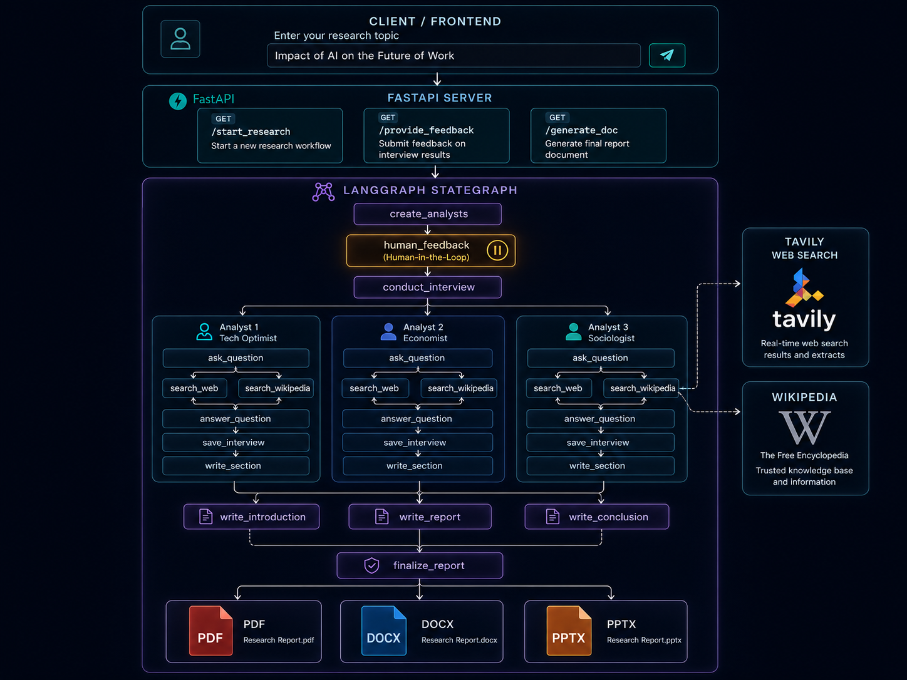

# 🔬 Research Agent

**An AI-powered multi-agent research pipeline that autonomously generates structured reports from any topic.**

[](https://www.python.org/)
[](https://fastapi.tiangolo.com/)
[](https://langchain-ai.github.io/langgraph/)
[](https://www.langchain.com/)
[](https://openai.com/)
[](https://tavily.com/)
[](LICENSE)
[]()

---

## 🏗️ Architecture



---

## 📌 Overview

**Research Agent** is a multi-agent AI system built with **LangGraph** and **FastAPI** that automates deep research on any given topic. It spawns a team of AI analysts with distinct personas, conducts parallel simulated expert interviews, searches the web and Wikipedia for grounded context, and synthesizes all findings into a structured, exportable report.

The system features a human-in-the-loop checkpoint, allowing users to review and refine the analyst panel before research commences. Final reports can be exported as PDF, DOCX, or PPTX.

---

## ✨ Features

- 🤖 **Multi-agent orchestration** via LangGraph `StateGraph` with parallel interview sub-graphs
- 🧑‍💼 **Dynamic analyst generation** — creates N AI analysts with unique roles, affiliations, and research focus areas
- 🔁 **Human-in-the-loop** — pause after analyst creation to review or refine the panel before proceeding
- 🌐 **Dual-source retrieval** — Tavily web search + Wikipedia for grounded, factual answers
- 📝 **Structured report generation** — introduction, body sections, conclusion, and sources assembled automatically
- 📤 **Multi-format export** — download the final report as PDF, DOCX, or PPTX
- ⚡ **FastAPI backend** — stateful REST API with session management via UUID thread IDs
- 🧩 **Custom prompt templates** — override the default research template per request

---

## 🗂️ Project Structure

```
Research_agent/
├── main.py              # FastAPI app — REST endpoints and session management
├── researchAgent.py     # Main LangGraph research graph (outer loop)
├── interview.py         # Interview sub-graph — analyst creation, Q&A, web/wiki search
├── doc_generator.py     # PDF, DOCX, and PPTX export logic
└── prompts.py           # All LLM prompt templates
```

---

## 🛠️ Tech Stack

| Component | Library / Tool |
|---|---|
| Agent Orchestration | [LangGraph](https://langchain-ai.github.io/langgraph/) |
| LLM Framework | [LangChain](https://www.langchain.com/) |
| LLM Provider | OpenAI-compatible API (via Novita AI or any endpoint) |
| Web Search | [Tavily Search](https://tavily.com/) |
| Wikipedia Search | `langchain_community.WikipediaLoader` |
| API Backend | [FastAPI](https://fastapi.tiangolo.com/) |
| State Persistence | `langgraph.checkpoint.memory.MemorySaver` |
| Document Export | `python-docx`, `reportlab` / `fpdf`, `python-pptx` |
| Language | Python 3.10+ |

---

## 🔄 How It Works

1. **Client sends a research request** — topic, number of analysts, optional custom prompt template
2. **`create_analysts` node** — LLM generates N analyst personas (name, role, affiliation, description)
3. **`human_feedback` node** — execution pauses; client reviews analysts and optionally requests refinement
4. **`conduct_interview` (parallel)** — each analyst runs an independent interview sub-graph:
   - Generates questions based on their persona
   - Searches the web (Tavily) and Wikipedia in parallel
   - LLM synthesizes answers from retrieved context
   - Saves the full interview transcript
   - Writes a focused section memo
5. **Report assembly (parallel)** — `write_report`, `write_introduction`, and `write_conclusion` run concurrently
6. **`finalize_report`** — merges all sections into a structured final report with optional sources
7. **Export** — client requests the report as PDF, DOCX, or PPTX

---

## ⚙️ Installation

### 1. Clone the repository

```bash
git clone https://github.com/Vigneshkumar-1211/Research_agent.git
cd Research_agent
```

### 2. Create a virtual environment

```bash
python -m venv venv
source venv/bin/activate        # macOS / Linux
venv\Scripts\activate           # Windows
```

### 3. Install dependencies

```bash
pip install -r requirements.txt
```

### 4. Configure environment variables

Create a `.env` file in the project root:

```env
MODEL=your-model-name
NOVITA_API_KEY=your-api-key
OPENAI_BASE=https://api.novita.ai/v3/openai   # or any OpenAI-compatible base URL
TAVILY_API_KEY=your-tavily-api-key
```

> The agent is compatible with any OpenAI-compatible endpoint — Novita AI, OpenRouter, Azure OpenAI, or the official OpenAI API.

---

## 🚀 Usage

### Start the API server

```bash
uvicorn main:app --reload
```

The API will be available at `http://localhost:8000`.

### API Endpoints

#### `POST /start_research`
Initiates a research session and returns generated analysts + a session thread ID.

```json
{
  "topic": "Quantum Computing",
  "max_analysts": 3,
  "templatePrompt": null
}
```

**Response:**
```json
{
  "analysts": [...],
  "thread_id": "uuid-string"
}
```

#### `POST /provide_feedback`
Resumes the paused graph. Send `null` as feedback to approve analysts and proceed.

```json
{
  "thread_id": "uuid-string",
  "human_feedback": "Add an economist analyst focused on industry adoption costs."
}
```

#### `POST /generate_doc`
Downloads the final report in the requested format.

```json
{
  "format": "pdf",
  "content": "...final report markdown string..."
}
```

Supported formats: `pdf`, `doc`, `ppt`

---

## 📋 Prerequisites

- Python **3.10** or higher
- A **Tavily API key** — [sign up free](https://tavily.com/)
- An **OpenAI-compatible API key** (Novita AI, OpenRouter, or OpenAI)
- A frontend or API client (e.g. Postman, curl, or a React app on `localhost:3000`)

---

## 🤝 Contributing

Contributions are welcome! To contribute:

1. Fork the repository
2. Create a feature branch: `git checkout -b feature/your-feature-name`
3. Commit your changes: `git commit -m "feat: add your feature"`
4. Push to the branch: `git push origin feature/your-feature-name`
5. Open a Pull Request

---

## 📄 License

This project is licensed under the [MIT License](LICENSE).

---

## 👤 Author

**Vigneshkumar**
- GitHub: [@Vigneshkumar-1211](https://github.com/Vigneshkumar-1211)

---

*Built with LangGraph, LangChain, FastAPI, and OpenAI-compatible LLMs.*

⭐ **Star this repo if you found it useful!**